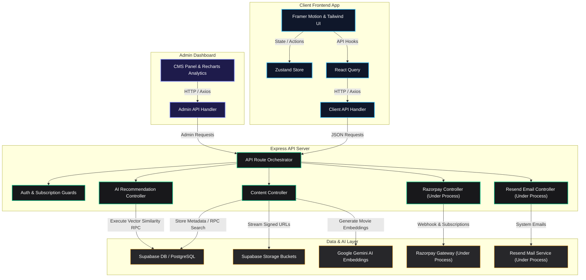

# 🎬 CINERA — AI-Assisted Video Streaming Platform

Welcome to **CINERA**, a modular full-stack video streaming application. Built with a modern multi-workspace architecture, CINERA features secure media streaming via Supabase signed URLs, an AI recommendation engine utilizing Google Gemini vector embeddings, subscription billing through Razorpay *(Under Process)*, notifications *(Under Process)*, platform analytics, and an admin CMS dashboard.

---

## 📌 Architecture & System Design

CINERA is designed using a multi-workspace structure, separating concerns into **Client**, **Server**, and **Admin Dashboard** directories.



---

## 🛠️ The Tech Stack

| Domain | Technology / Library | Description |
| :--- | :--- | :--- |
| **Core Runtime** | Node.js (ESM) | Backend JavaScript runtime. |
| **Backend Framework** | Express.js (v5.1) | Web framework for routing and API middleware. |
| **Database & Auth** | Supabase | PostgreSQL relational database, authentication provider, and object storage. |
| **User Frontend** | React (v19) + Vite | Component-driven frontend application. |
| **Admin Panel** | React (v19) + Vite + Recharts | Admin dashboard for content management and analytics. |
| **Styling & UI** | Tailwind CSS (v4) | Utility-first CSS framework. |
| **Animations** | Framer Motion | Animation library for UI transitions. |
| **State Management** | Zustand | Centralized state management store. |
| **Data Fetching** | TanStack React Query (v5) | Server-state management and caching library. |
| **AI / Machine Learning** | Google Gemini Embeddings | `text-embedding-004` vector embeddings generation for similarity search. |
| **Payment Gateway** | Razorpay SDK *(Under Process)* | Subscription billing and webhook handling *(Under Process)*. |
| **Email Delivery** | Resend API *(Under Process)* | Transactional email delivery *(Under Process)*. |

---

## 📁 Repository Structure

```
CINERA/
├── Client/                      # User-Facing Streaming App
│   ├── src/
│   │   ├── app/                 # Routing, Global Providers
│   │   ├── components/          # Reusable Layouts & UI Components
│   │   ├── features/            # Auth, Content, Search, History, Notifications (Under Process), Billing (Under Process), Player
│   │   ├── lib/                 # Axios configurations and SDK wrappers
│   │   └── styles/              # Global Tailwind styling configs
│   ├── package.json
│   └── vite.config.js
│
├── CINERA_ADMIN_DASHBOARD/      # Platform CMS & Admin Panel
│   ├── src/
│   │   ├── app/                 # Routes & Setup
│   │   ├── components/          # Dashboard layouts & navigation elements
│   │   ├── features/            # CMS Actions: Content, Genres, Analytics, Auth
│   │   └── index.css
│   ├── package.json
│   └── vite.config.js
│
└── Server/                      # Backend Express Application
    ├── Config/                  # Database connections & API client orchestrators
    ├── Controllers/             # Modular request/response pipeline controllers
    ├── Middlewares/             # JWT Auth, Admin, and Subscription check guards
    ├── Routes/                  # Endpoint routers (Content, Search, Stream, Billing, History, etc.)
    ├── Utils/                   # AI embedding helpers, Resend email senders, loggers
    ├── app.js                   # Application middlewares & CORS
    ├── server.js                # Port initialization and listener
    └── package.json
```

---

## ⚡ Core Features

1. **AI Recommendation System**: Generates embedding vectors for title descriptions using **Google Gemini** (`text-embedding-004`). Executes cosine similarity math in Supabase via Postgres functions (`RPC`) to fetch similar movies based on content metadata and user preferences.
2. **Signed-URL Video Streaming**: Protects direct media paths by generating temporary signed streaming URLs with a 1-hour expiration limit via Supabase Storage.
3. **Subscriptions (Razorpay) [Under Process]**: Handles subscription plans and webhook payload processing for user billing updates.
4. **Admin CMS & Analytics**: Allows platform admins to manage movie metadata, genres, subscription plans *(Under Process)*, and inspect view analytics via interactive charts.
5. **Transactional Emails & Notifications [Under Process]**: Delivers system notification updates and password resets via the **Resend API**.

---

## ⚙️ Environment Variables & Configuration

To run CINERA locally, create `.env` files in the respective workspace directories.

### 1. Backend Server (`Server/.env`)
```env
PORT=5000
NODE_ENV=development

# Supabase Credentials
SUPABASE_URL=https://<your-project>.supabase.co
SUPABASE_SERVICE_KEY=<your-secret-service-role-key>
SUPABASE_ANON_KEY=<your-anon-public-key>

# JWT Keys
JWT_SECRET=<your-user-jwt-secret-string>
ADMIN_JWT_SECRET=<your-admin-jwt-secret-string>
JWT_EXPIRES_IN=2h

# Google AI & OAuth
GEMINI_API_KEY=<your-google-gemini-api-key>
GOOGLE_CLIENT_ID=<your-google-oauth-client-id>

# Transactional Emails (Under Process)
RESEND_API_KEY=<your-resend-api-key>

# Payments Integration (Under Process)
RAZORPAY_KEY_ID=<your-razorpay-key-id>
RAZORPAY_KEY_SECRET=<your-razorpay-key-secret>
RAZORPAY_WEBHOOK_SECRET=<your-razorpay-webhook-secret>

# CORS
FRONTEND_URL=http://localhost:5173
```

### 2. Client Application (`Client/.env`)
```env
VITE_API_BASE_URL=http://localhost:5000/api
```

### 3. Admin Dashboard (`CINERA_ADMIN_DASHBOARD/.env`)
```env
VITE_API_BASE_URL=http://localhost:5000/api
```

---

## 🚀 Getting Started

Follow these steps to run the CINERA services locally.

### Step 1: Install Dependencies
Navigate into each module folder and install Node dependencies:
```bash
# Install Server modules
cd Server && npm install

# Install Client modules
cd ../Client && npm install

# Install Admin Dashboard modules
cd ../CINERA_ADMIN_DASHBOARD && npm install
```

### Step 2: Running the Server
Run the Express backend:
```bash
cd Server
npm run dev
```
The server will run on `http://localhost:5000`.

### Step 3: Running the Client Frontend
Launch the user-facing application:
```bash
cd Client
npm run dev
```
The application will run on `http://localhost:5173`.

### Step 4: Running the Admin Dashboard
Launch the admin dashboard:
```bash
cd CINERA_ADMIN_DASHBOARD
npm run dev
```
The dashboard will run on `http://localhost:5174`.

---

## 🗄️ Database & RPC Requirements

CINERA utilizes Supabase PostgreSQL tables and Remote Procedure Calls (RPCs). Below is the list of database requirements:

### Required Tables
- `content` — Movie metadata, duration, tags, embeddings vector.
- `plans` — Platform subscription pricing configurations *(Under Process)*.
- `subscriptions` — User payment profiles and billing states *(Under Process)*.
- `favorites` — User bookmark records.
- `watch_history` — User watch progress tracking across videos.
- `user_taste` — Dynamic user search behavior and interest markers.
- `notifications` — In-app alerts queue *(Under Process)*.
- `password_reset_codes` — Temporary keys for password recovery.
- `admins` — Credentials for admin dashboard operators.
- `analytics` — Page views, interactions, and session metrics.

### Required Database RPC Functions
- `match_content` — Executes cosine similarity vector math to retrieve matching content vectors.
- `recommend_for_user` — Resolves titles closest to a user's recent favorites and watch history.
- `search_fulltext` — Standard text search index querying.
- `get_trending_content` / `get_popular_content` — Analytics aggregates measuring view counts over time.

---

## 🛡️ License & Attributions

Developed by **Durga Prasad** (GitHub: [@Durgaprasad-Developer](https://github.com/Durgaprasad-Developer)).